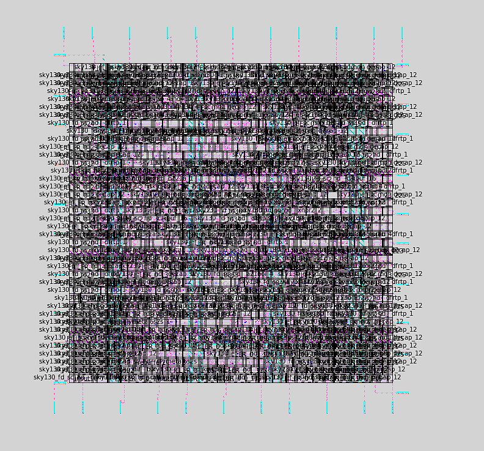

# 8-bit ALU – Complete RTL to GDS-II ASIC Design Flow

This repository presents the **end-to-end design and implementation of an 8-bit Arithmetic Logic Unit (ALU)**, covering the full **ASIC design flow from RTL to GDS-II** using **industry-relevant open-source EDA tools**.

The project demonstrates practical understanding of **digital design, logic synthesis, and physical design**, culminating in a **clean, manufacturable layout** generated using the **Sky130 open-source PDK**.

##  Project Overview

The 8-bit ALU supports multiple arithmetic and logical operations and generates standard status flags.  
The design was taken through the following stages:

- RTL design and verification
- Logic synthesis
- Automated physical design (floorplanning to signoff)
- Final GDS-II generation and layout inspection

## Supported ALU Operations
- Addition
- Subtraction
- AND
- OR
- XOR
- NOT
- Increment
- Decrement
- Multiplication

### Status Flags
- CarryOut
- Zero
- Sign
- Overflow

##  Repository Structure

- rtl/ # Verilog RTL, testbench, simulation waveform
- synthesis/ # Logic synthesis using Yosys (netlist, stats, visuals)
- physical design/ # Complete RTL to GDS-II physical design flow
- README.md # Project overview (this file)

##  Toolchain Summary

- **Verilog HDL** – RTL design
- **Icarus Verilog + GTKWave** – RTL simulation and waveform analysis
- **Yosys** – Logic synthesis and gate-level netlist generation
- **OpenLane** – Automated RTL to GDS-II ASIC flow
- **OpenROAD / OpenSTA** – Physical design and timing analysis (via OpenLane)
- **Magic** – Layout visualization and DRC
- **KLayout** – GDS inspection
- **PDK** – Sky130 (`sky130_fd_sc_hd`)

## Design Flow

1. RTL design of an 8-bit ALU using Verilog HDL.
2. Functional verification using a Verilog testbench and waveform analysis.
3. Logic synthesis using Yosys to generate a gate-level netlist.
4. Floorplanning to define die area, core utilization, and power distribution.
5. Standard cell placement within the defined core area.
6. Clock Tree Synthesis to distribute the clock with controlled skew.
7. Global and detailed routing of signal, clock, and power nets.
8. Static timing analysis to ensure timing closure.
9. Physical verification including DRC, LVS, and antenna checks.
10. Generation of final manufacturable GDS-II layout.

## Final Layout Preview

##  Key Highlights

- Successfully completed **full RTL to GDS-II flow**
- Achieved **timing closure with zero negative slack**
- No **DRC, LVS, or antenna violations**
- Generated **manufacturable GDS-II layout**
- Used **open-source tools aligned with industry ASIC flows**

## Learning Outcomes

- Practical understanding of **ASIC design flow**
- Hands-on experience with **open-source EDA tools**
- Interpretation of **timing, area, and routing metrics**
- Exposure to **PDK-based standard cell design**

